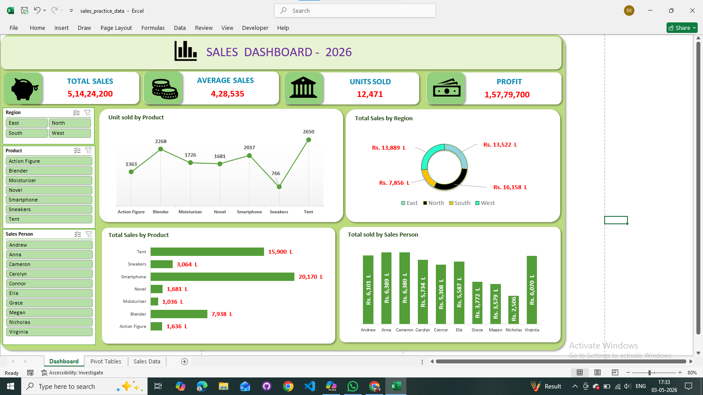

# 📊 Sales Dashboard 2026 — Excel

An interactive **Sales Dashboard** built entirely in Microsoft Excel, featuring dynamic charts, pivot tables, slicers, and KPI cards to analyze sales performance across regions, products, and sales persons.

---

## 🔴 Live Dashboard

👉 **[View Live Dashboard](https://onedrive.live.com/:x:/g/personal/95c4028dbb4287d1/IQCrIp-J7GAQSIy3hTGIAnSWAfLNxwwbjs750RzKBeh6leE?rtime=XapaNxiu3kg&redeem=aHR0cHM6Ly8xZHJ2Lm1zL3gvYy85NWM0MDI4ZGJiNDI4N2QxL0lRQ3JJcC1KN0dBUVNJeTNoVEdJQW5TV0FmTE54d3dianM3NTBSektCZWg2bGVFP2U9NWN6MWV3)**

---

## 📸 Dashboard Preview

  

---

## 📊 Dashboard Features

### 🔢 KPI Summary Cards
| Metric | Value |
|---|---|
| Total Sales | Rs. 5,14,24,200 |
| Average Sales | Rs. 4,28,535 |
| Units Sold | 12,471 |
| Total Profit | Rs. 1,57,79,700 |

### 📈 Charts & Visualizations
- **Units Sold by Product** — Line chart showing unit volume per product category
- **Total Sales by Region** — Donut chart comparing East, West, North, and South
- **Total Sales by Product** — Horizontal bar chart ranking products by revenue
- **Total Sold by Sales Person** — Vertical bar chart comparing individual performance

### 🎛️ Interactive Slicers
- **Region** — Filter by East, North, South, West
- **Product** — Filter by Action Figure, Blender, Moisturizer, Novel, Smartphone, Sneakers, Tent
- **Sales Person** — Filter by individual team members

---

## 🛠️ Tools Used

- **Microsoft Excel** — Pivot Tables, Charts, Slicers, Conditional Formatting
- **Excel Formulas** — SUMIF, AVERAGEIF, dynamic KPI calculations
- **Data Visualization** — Line, Bar, Donut charts with custom formatting

---

## 📌 Key Insights

- 🏆 **Smartphone** is the top-selling product with **Rs. 20,170 L** in revenue
- 🥇 **Tent** is the second highest with **Rs. 15,900 L**
- 🌍 **West region** leads in sales with **Rs. 16,158 L**
- 👤 **Andrew** is the top sales person with **Rs. 6,101 L**
- 📦 **Tent** has the highest units sold **(2,650 units)**

---

## 🤝 Connect with Me

I'm always open to feedback, collaborations, and discussions!

&nbsp;

---

⭐ **If you found this project useful, please consider giving it a star!**
